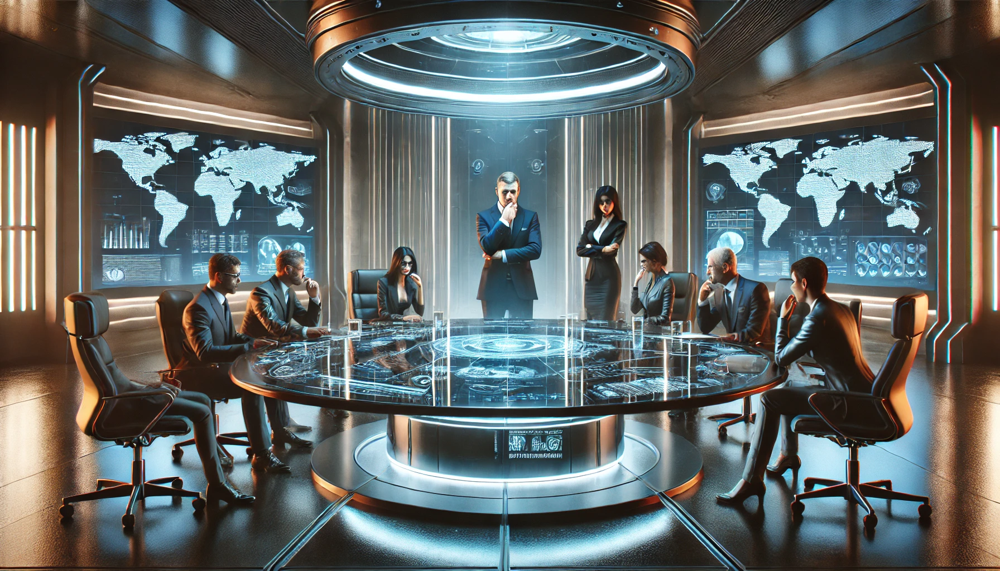

# Conversations

## High-Rank Executives Discussing How to Extend the Cover-Up

**Scene:** A private meeting room in the upper levels of the facility. Executive Director Hargrove and Chief of Security Mason are discussing the growing risk of exposure. The room is soundproofed, with a single large screen displaying live security feeds.  

**Hargrove:** [Calmly sipping coffee] “Our operations are expanding, Mason. Larger shipments, more personnel, higher risk. We need tighter controls to avoid…unfortunate leaks.”  

**Mason:** [Leaning forward] “I’ve already authorized rotating schedules for the lower-level staff. No one works the same shift long enough to notice patterns. But we can’t rely on obfuscation forever. Rumors are already spreading.”  

**Hargrove:** [Raises an eyebrow] “Rumors? About what?”  

**Mason:** [Sternly] “They think we’re running black ops for a foreign power. It’s laughable, but plausible enough to keep prying eyes off us. For now.”  

**Hargrove:** [Leaning back] “Then let’s feed the narrative. Plant evidence—encrypted communications, forged documents. Make it seem like we’re conducting espionage for...let’s say China.”  

**Mason:** “That’ll keep lower-tier UNATCO agents busy, but what about the higher-ups?”  

**Hargrove:** [Smiling faintly] “We’ll offer just enough breadcrumbs to satisfy them. A leak here, a misfiled document there. Everyone loves a good red herring.”  

**Mason:** [Nods] “And if someone stumbles onto the truth?”  

**Hargrove:** [Coldly] “Contain it. Permanently.”

---

## Aligning with Deus Ex

- **Executive Cover-Up:** A conspiracy within a conspiracy, this showcases MJ12’s willingness to manipulate anyone to protect their secrets, reinforcing the themes of power and deception.  

---

## High-Rank Executives Discussing How to Extend the Cover-Up

**Scene:** In a sleek, dimly lit boardroom buried deep within the MJ12 facility, the top brass meet to address growing suspicions among the public and even some factions within UNATCO.  

**Director Allen:** [Calm but stern] “Gentlemen, our operations are under scrutiny. Reports of unusual activity have surfaced in sectors we deemed secure.”  

**Dr. Venner:** [Adjusting her glasses] “The Grey Death trials are impossible to contain entirely. People talk. Bodies turn up. It’s only a matter of time before the wrong journalist gets a lead.”  

**Commander Rourke:** [Grinning darkly] “Let them dig. A few disappearances will remind them of the cost of curiosity.”  

**Director Allen:** [Icy glare] “Blunt tools attract attention, Commander. We need subtlety.”  

**Dr. Venner:** [Leaning forward] “There’s another option. If we can fabricate evidence tying these suspicions to foreign actors—perhaps the Chinese or the Russians—it would muddy the waters.”  

**Director Allen:** [Nods slowly] “A manufactured espionage narrative. We frame it as a cyberwarfare initiative targeting our global partners. It buys us time and shifts the blame.”  

**Commander Rourke:** [Skeptical] “That’s a gamble. If anyone ties the threads back to us…”  

**Dr. Venner:** [Smirking] “Then we’ve already failed, haven’t we?”  

**Director Allen:** [Sharply] “Failure is not an option. Deploy the misinformation campaign. Leak fabricated memos. And double down on internal loyalty sweeps—there are whispers among the lower ranks.”  

**Commander Rourke:** [Reluctantly] “Understood. But don’t be surprised if I clean house while we’re at it.”  

---

## High-Rank Executives Discussing How to Extend the Cover-Up

**Scene:** In a sleek, dimly lit boardroom buried deep within the MJ12 facility, the top brass meet to address growing suspicions among the public and even some factions within UNATCO.  

**Director Allen:** [Calm but stern] “Gentlemen, our operations are under scrutiny. Reports of unusual activity have surfaced in sectors we deemed secure.”  

**Dr. Venner:** [Adjusting her glasses] “The Grey Death trials are impossible to contain entirely. People talk. Bodies turn up. It’s only a matter of time before the wrong journalist gets a lead.”  

**Commander Rourke:** [Grinning darkly] “Let them dig. A few disappearances will remind them of the cost of curiosity.”  

**Director Allen:** [Icy glare] “Blunt tools attract attention, Commander. We need subtlety.”  

**Dr. Venner:** [Leaning forward] “There’s another option. If we can fabricate evidence tying these suspicions to foreign actors—perhaps the Chinese or the Russians—it would muddy the waters.”  

**Director Allen:** [Nods slowly] “A manufactured espionage narrative. We frame it as a cyberwarfare initiative targeting our global partners. It buys us time and shifts the blame.”  

**Commander Rourke:** [Skeptical] “That’s a gamble. If anyone ties the threads back to us…”  

**Dr. Venner:** [Smirking] “Then we’ve already failed, haven’t we?”  

**Director Allen:** [Sharply] “Failure is not an option. Deploy the misinformation campaign. Leak fabricated memos. And double down on internal loyalty sweeps—there are whispers among the lower ranks.”  

**Commander Rourke:** [Reluctantly] “Understood. But don’t be surprised if I clean house while we’re at it.”  

---

## High-Rank Executives Discussing How to Extend the Cover-Up

The boardroom was silent, save for the hum of the holographic table. A rotating map of the lab’s global connections hovered above, with a few red warning indicators blinking ominously.

- **Director Fenton:** "Let’s get one thing clear: if even a whisper of this leaks, we’re not just looking at career-ending headlines. We’re looking at global chaos."

- **Executive Daniels:** "Our current cover—‘advanced agriculture research’—won’t hold. People are asking why we have so much classified military funding."

- **Director Fenton:** "Then we pivot. Push out a fake breakthrough. Something big enough to distract them, but benign enough not to invite further scrutiny."

- **Executive Sharpe:** "And what about the internal leaks? I’ve heard rumors among lower-tier staff. They think we’re building a weapon to wipe out competitors."

- **Director Fenton:** "Let them think that. It’s better than them guessing the truth."

The tension escalated as a junior executive cautiously interjected:

- **Junior Executive Lin:** "Sir, I... We’ve had reports of an unusual spike in electromagnetic activity around the facility. Could that—"

Fenton cut him off.

- **Director Fenton:** "It’s nothing. Focus on the narrative. If we keep control of the story, no one will look beneath the surface."

---
