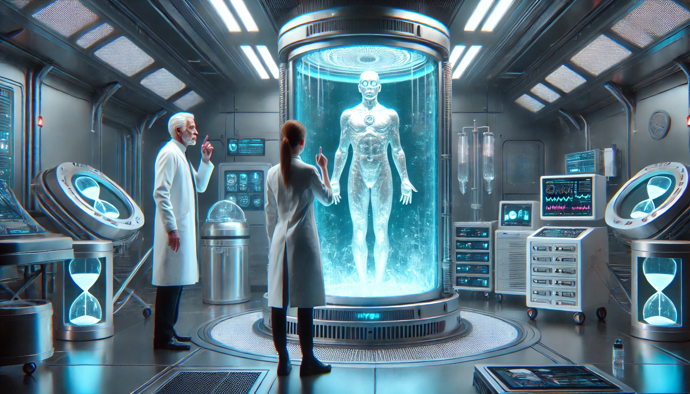

# Conversations

## Biologist Mistakes the Alien Envoy for a Failed Experiment

**Scene:** A sterile lab filled with containment pods. Biologist Dr. Lin and her assistant Thomas are examining files on a recently discovered subject—the alien envoy. Lin is visibly agitated, pacing while Thomas scrolls through a tablet.  

- **Thomas:** [Squinting at the screen] “This subject doesn’t match any of our test logs. No baseline DNA, no augmentation records. Are you sure it’s one of ours?”  

- **Dr. Lin:** [Impatiently] “Of course. What else could it be? Some…freak accident, maybe. An amalgam of failed splicing trials.”  

- **Thomas:** “Amalgam? This thing’s genome is pristine. No mutations, no degradation. It’s...too perfect.”  

- **Dr. Lin:** [Snaps] “Which means it’s non-viable. Terminate it and reallocate the pod for more promising samples.”  

Suddenly, Dr. Greene, the senior researcher, enters the lab, visibly alarmed.  

- **Dr. Greene:** “Wait! You’re not authorized to terminate that specimen.”  

- **Dr. Lin:** [Startled] “Why? It’s clearly an anomaly, not part of the program.”  

- **Dr. Greene:** [Firmly] “Because it’s not one of ours. That subject...is an asset.”  

- **Thomas:** [Confused] “An asset? What the hell does that mean?”  

- **Dr. Greene:** [Leaning in] “It means you’re not asking questions, Lin. It means you’re filing a report that says this subject was ‘classified.’ And it means, from this moment forward, you never saw it.”  

- **Dr. Lin:** [Reluctantly] “Understood.”  

Greene watches them sternly before exiting, leaving Lin and Thomas exchanging uneasy glances.  

---

## Aligning with Deus Ex

- **Alien Envoy:** Mistaking the alien for a failed experiment highlights humanity’s hubris and misunderstanding of the unknown, adding layers to the extraterrestrial subplot.  

---

## Biologist Mistakes the Alien Envoy for a Failed Experiment

**Scene:** Dr. Eileen Vaughn is in her personal lab, inspecting a sealed cryo-chamber labeled “Specimen Zeta.” The alien envoy, still recovering from his wounds, is inert but alive. Vaughn believes she’s dealing with a failed human-augmentation experiment.  

- **Dr. Vaughn:** [Recording into a log] “Specimen Zeta remains unresponsive. Muscle density is remarkable, but neural activity is…chaotic. Attempts to stabilize cognitive patterns have failed.”  

She leans in, observing faint iridescence on the specimen’s skin.  

- **Dr. Vaughn:** [To herself] “What went wrong with you? Were you exposed to something in the field?”  

Suddenly, the specimen’s eyes open. They glow faintly, and Vaughn stumbles backward.  

- **Specimen Zeta:** [Weakly] “Help…me.”  

- **Dr. Vaughn:** [Startled] “You’re…conscious?”  

The specimen doesn’t respond further. Vaughn hesitates, then reaches for a syringe of sedative.  

- **Dr. Vaughn:** [Nervously] “I need to stabilize you before this escalates.”  

At that moment, her superior, Dr. Garrett, enters the lab.  

- **Dr. Garrett:** [Sharply] “What are you doing?!”  

- **Dr. Vaughn:** [Defensively] “I was containing an unstable specimen!”  

- **Dr. Garrett:** [Frowning] “That’s not a specimen, Eileen. That’s our guest.”  

Vaughn looks at him, confused.  

- **Dr. Vaughn:** “Guest? He doesn’t even look human!”  

- **Dr. Garrett:** [Lowering his voice] “Because he isn’t. He’s an envoy. And if you terminate him, you’ll start a war we can’t win.”  

- **Dr. Vaughn:** [Incredulous] “A war with who?”  

- **Dr. Garrett:** [Gravely] “With the stars.”  

---

## Biologist Mistakes the Alien Envoy for a Failed Experiment

In the sterile glow of the cryo-chamber room, Dr. Eliza Foster stared at the alien figure encased in translucent glass. Its faintly glowing veins and iridescent skin screamed "failure" to her.  

- **Dr. Foster:** "Another botched experiment. Third one this week. Just look at this thing."  

Her assistant, Max, squinted at the data.  

- **Max:** "The vitals are... strange. Stable, but not human. Could it be—"  

- **Dr. Foster:** "It’s another genetic splicing disaster. Probably from Batch 42. Log it for termination and—"  

Before she could finish, the room’s intercom crackled, and a cold, commanding voice interrupted.  

- **Director Fenton:** "Dr. Foster, step away from the chamber immediately."  

- **Dr. Foster:** "Sir? This thing’s just another—"  

- **Director Fenton:** "That 'thing' is not part of your experiment. And it’s not yours to terminate. Clear the room."  

Foster and Max exchanged confused glances as armed guards entered. Fenton approached the chamber, his expression unreadable.  

- **Max:** (whispering) "What do you think it is?"  

- **Dr. Foster:** (equally quiet) "I don’t know. But I’m starting to think we’re not the ones running this lab."  

---
