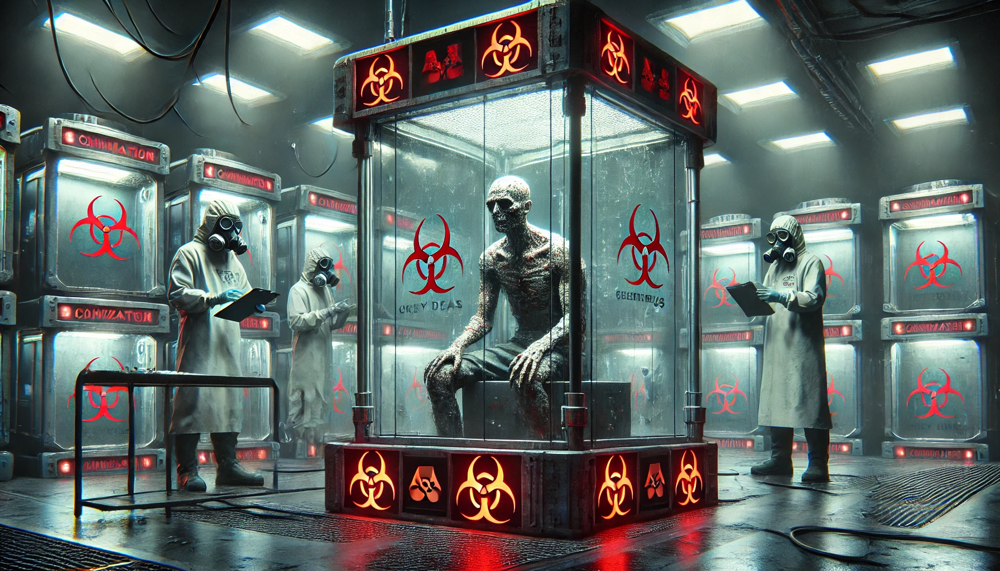

# Conversations

## Biologist Working on the Grey Death Virus and Its Vaccine

**Scene:** A sterile laboratory. Biologist Dr. Patel and her assistant, Leo, are analyzing data from their latest trials on the Grey Death virus. The atmosphere is tense.  

**Dr. Patel:** [Staring at a monitor] “This strain is…unpredictable. Look here—Subject 13 developed respiratory failure within six hours, but Subject 14? Nothing. Completely asymptomatic.”  
**Leo:** [Frowning] “That doesn’t make sense. They were both dosed with the same viral load.”  
**Dr. Patel:** “Exactly. Which means there’s an unknown factor we’re missing. Some genetic variable or environmental trigger. We need to isolate it.”  
**Leo:** [Scrolling through notes] “And the vaccine prototype? Any progress?”  
**Dr. Patel:** [Shaking her head] “The antigen works in vitro, but in live subjects? It amplifies the symptoms. Subject 15 suffered complete cellular breakdown within minutes.”  
**Leo:** [Horrified] “So…we’re creating something worse than the virus itself.”  
**Dr. Patel:** [Softly] “Worse, but effective. If MJ12 gets their hands on this, they won’t stop at a cure. They’ll weaponize it.”  
**Leo:** [Leaning in] “Maybe they already have. What if this isn’t about a cure at all?”  
**Dr. Patel:** [Pausing] “Leo…be careful what you say out loud. Even in here.”  

---

## The Unstable Grey Death Virus – A Breakthrough with Dire Consequences

**Scene:** Dr. Patel and Leo are in a secluded corner of the lab, reviewing the latest developments on the Grey Death virus. Alarms buzz faintly in the distance.  

**Dr. Patel:** [Leaning over a glowing monitor] “This is it, Leo. The virus finally stabilized…for one subject.”  
**Leo:** [Flipping through files] “You mean Subject 17? The prisoner? What happened?”  
**Dr. Patel:** [Quietly] “Not just survival. Adaptation. Their immune system mutated to incorporate the virus as part of its defenses.”  
**Leo:** [Frowning] “But the others—”  
**Dr. Patel:** [Cutting him off] “I know. 19 fatalities in the last batch. But this—this changes everything. Imagine the applications.”  
**Leo:** [Lowering his voice] “Applications? Patel, you know what MJ12 will do with this. They’re not looking for a cure. They’re perfecting a bioweapon.”  
**Dr. Patel:** [Coldly] “It’s not our place to question the directive.”  
**Leo:** [Sighing] “And what about Subject 17? They’ve become…something else. If they get loose—”  
**Dr. Patel:** [Grimly] “Then they’ll be the prototype for the next phase.”  

---

## The Unstable Grey Death Virus – A Breakthrough with Dire Consequences

**Scene:** Dr. Patel and Leo are in a sterile lab filled with glowing monitors, specimen containers, and the faint hum of air filters. The tension is palpable as the two review the latest experiment data.  

**Dr. Patel:** [Tapping the monitor with urgency] “Leo, this sequence—do you see it? Look at the immune response curve.”  
**Leo:** [Leaning closer] “That’s…impossible. Subject 17’s immune markers aren’t just resisting the virus—they’re amplifying it.”  
**Dr. Patel:** [Smirking slightly] “Not amplifying, adapting. The virus is now a symbiotic enhancement, not a pathogen.”  
**Leo:** [Voice rising] “Symbiotic? For one subject out of twenty? What about the others, Patel? Do their corpses count as a footnote to your success?”
**Dr. Patel:** [Coldly] “Progress always comes at a cost. You know that as well as I do.”  
**Leo:** [Pacing] “The cost is too high. And you know what’s next—MJ12 won’t care about curing this thing. They’ll weaponize it. How long before they test it on civilians?”  
**Dr. Patel:** [Quietly, almost to herself] “It’s not our place to decide how the data is used.”  
**Leo:** [Turning to face her] “But it will be our legacy. Do you really want that?”  
The room falls silent except for the faint beeping of machinery. In the corner, a containment chamber holds the unnervingly calm Subject 17, their eyes glowing faintly in the low light.  

---

## The Grey Death – A Risky Experiment and a Desperate Decision

**Scene:** Dr. Patel is working alone in the lab late at night, reviewing the latest data. Leo enters, looking visibly shaken, clutching a classified file.  

**Leo:** [Slamming the file onto the table] “Patel, we have a problem. The higher-ups are fast-tracking deployment. They’re calling it ‘field testing.’”  
**Dr. Patel:** [Without looking up] “That’s what they always call it. What did you expect?”  
**Leo:** [Frustrated] “I expected a cure! We’re supposed to be stopping this thing, not spreading it.”  
Dr. Patel sighs and turns to face him. The strain of the project is evident in her tired eyes.  
**Dr. Patel:** [Quietly] “Do you think I don’t know what’s at stake? This virus is our ticket to survival—or extinction. If MJ12 wants field data, we don’t have a choice.”  
**Leo:** [Desperate] “We do have a choice. We sabotage it. Delay them. Give ourselves time to fix this mess.”  
**Dr. Patel:** [Leaning back] “And what happens when they find out? You think they’ll just let us walk away?”  
The room is silent for a moment, except for the faint hum of containment units. Finally, Leo speaks, his voice barely above a whisper.  
**Leo:** “They won’t find out. We make it look like an accident.”  
Dr. Patel’s gaze hardens as she considers the implications. On the screen behind her, Subject 17’s glowing eyes stare unblinkingly, as if watching them.  

---

## The Grey Death – A Moral Crossroads

**Scene:** Dr. Patel and Leo are in the observation room, watching Subject 17 through a glass partition. The subject is sweating profusely, his veins glowing faintly with the telltale signs of viral instability.  

**Leo:** [Pointing at the monitor] “The viral load’s spiking. His immune system can’t handle it.”  
**Dr. Patel:** [Tense] “It’s the same as the others. The virus evolves faster than the vaccine.”  
**Leo:** [Exasperated] “Then we’re back to square one. This isn’t a cure—it’s a time bomb.”  
**Dr. Patel:** [Quietly] “A time bomb they’re going to unleash.”  
The room goes silent as they watch the subject convulse. Suddenly, he stops moving, and his eyes snap open, glowing faintly.  
**Subject 17:** [Weakly] “You…you don’t have to do this.”  
**Leo:** [Startled] “Did he just—?”  
Dr. Patel moves closer to the glass, her hand trembling.  
**Dr. Patel:** “You can hear us?”  
**Subject 17:** [Nods slowly] “It’s not too late. Stop them…before it’s too late.”  
**Leo:** [Whispering to Patel] “If MJ12 finds out he’s aware…”  
**Dr. Patel:** [Resolute] “We need to get him out. Tonight.”  
Outside the room, the faint sound of approaching footsteps grows louder. Their time is running out.  

---

## The Grey Death – The Consequences of Defiance

**Scene:** Dr. Patel and Leo are preparing to move Subject 17 out of the lab. They’ve disabled the cameras in the observation wing, but time is running out as MJ12 security tightens its patrols.  

**Leo:** [Whispering, checking the hallway] “All clear—for now. He won’t last much longer if we don’t move.”  
**Dr. Patel:** [Helping Subject 17 to his feet] “We’re not leaving without the sample data. We’ll need proof if we’re going to stop this.”  
**Subject 17:** [Weakly] “There’s…another lab. They have…a vaccine.”  
Dr. Patel and Leo exchange a surprised look. Patel quickly grabs a data drive.  
**Dr. Patel:** “Where? Tell us.”  
**Subject 17:** [Coughing] “Sublevel 3…restricted access.”  
Alarms suddenly blare as red lights flood the corridor. A voice crackles over the intercom.  
**Intercom:** “Unauthorized activity in Observation Wing. Lockdown protocol initiated.”  
**Leo:** [Panicked] “We’ve been made!”  
They hurriedly push through the emergency doors, dodging patrolling guards. They reach a terminal, and Patel begins downloading files while Leo keeps watch.  
**Dr. Patel:** [Urgently] “This data could expose everything—this isn’t just a virus. It’s a weapon.”  
**Leo:** [Gritting his teeth] “Tell me something I don’t already know.”  
Suddenly, a shadow looms over them. A figure in heavy combat gear steps forward, aiming a weapon.  
**Agent Navarre:** [Coldly] “Step away from the console. Now.”  

---
