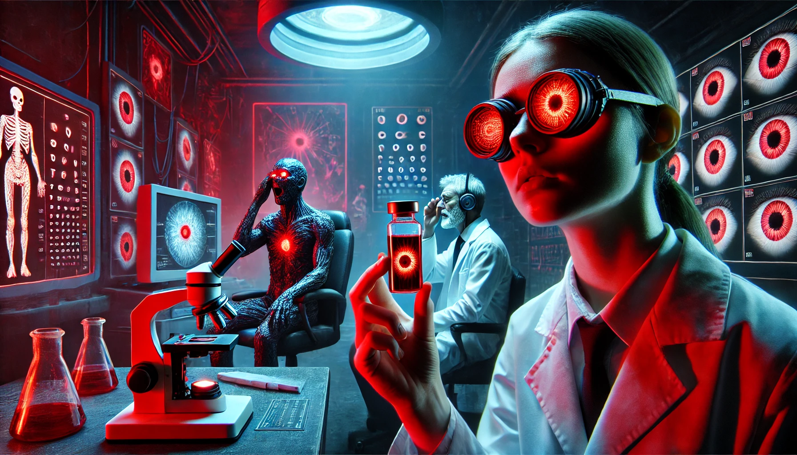

# Conversations

## Discussion About Infrared Vision Eye-Drops

**Scene:** In the testing lab. Technician Valerie is briefing Dr. Ross on the progress of their latest augmentation accessory—a controversial eye-drop formula.  

**Valerie:** [Holding a vial of clear liquid] “The formula works, as intended. Subjects report infrared vision for up to fifteen minutes post-application.”  

**Dr. Ross:** “Good. And the side effects?”  

**Valerie:** [Glancing nervously] “Well, that’s…complicated. The formula alters the pigmentation of the sclera and iris. It makes their eyes glow bright red.”  

**Dr. Ross:** [Chuckling] “A minor cosmetic inconvenience.”  

**Valerie:** “It’s more than cosmetic. The test subjects reported feeling…paranoid. Some claimed they saw shadows moving in the periphery. Others refused to look in mirrors. One subject even…”  

**Dr. Ross:** [Interrupting] “Even what?”  

**Valerie:** [Quietly] “They clawed at their own eyes. Said the red glow made them feel…possessed.”  

**Dr. Ross:** [Coldly] “Irrelevant. As long as it works in the field, we’ll refine the formula later. Run more tests, but keep this out of the reports for now.”  

---

## The Demonic Eye-Drop Incident

**Scene:** Valerie is briefing her assistant, a young researcher named Mia, about a containment issue with the experimental eye-drop formula.

**Valerie:** [Holding a clipboard] “Mia, I hope you didn’t schedule any new trials for today.”

**Mia:** [Confused] “No…why? Is something wrong?”

**Valerie:** [Glancing at the security feed] “We had an incident with one of the test subjects. The infrared-enhancement formula caused…psychosis.”

**Mia:** [Alarmed] “Psychosis? But it passed the preliminary tests!”

**Valerie:** [Sighing] “Apparently not. Subject 12 started ranting about seeing ‘entities’ in the walls. They tried to smash the containment glass with their bare hands.”

**Mia:** [Wide-eyed] “That’s…disturbing. And the glowing red eyes?”

**Valerie:** [Bitterly] “Still there. You’d think they were possessed. Security had to sedate them—again.”

**Mia:** [Quietly] “Maybe we’re looking at this all wrong. What if the formula isn’t just altering vision…but perception? What if they’re actually seeing something we can’t?”

**Valerie:** [Pausing] “Let’s keep that theory to ourselves, shall we? The higher-ups don’t like loose threads.”

---

## The Demonic Eye-Drop Incident

**Scene:** Valerie and Mia are standing in the experimental optics lab. Behind them, a sedated test subject lies strapped to a chair, their glowing red eyes partially visible through their eyelids.  

- **Mia:** [Flipping through a report] “Infrared acuity was perfect. But the psychological tests…”  

- **Valerie:** [Cutting her off] “I know. It’s the same with every subject. Irritability, hallucinations, paranoia—”  

- **Mia:** [Nervously] “And the red eyes. That’s not going to fly with anyone. It’s unsettling.”  

- **Valerie:** [Crossing her arms] “Unsettling? It’s terrifying. Half the lab is convinced these people are possessed.”  

- **Mia:** [Half-joking] “Honestly, I don’t blame them. Subject 8 claimed they saw shadows moving in the walls.”  

- **Valerie:** [Grimacing] “Don’t start with that. Last thing we need is more rumors.”  

Suddenly, a muffled groan escapes the test subject. Both women turn to look. The glowing eyes flicker open, staring at them with eerie intensity.  

- **Subject 8:** [Raspy] “They’re watching us…watching you…”  

Valerie quickly signals for sedation. As the technician approaches, she leans closer to Mia.  

- **Valerie:** [Whispering] “Whatever’s going on, we keep this under wraps. If the higher-ups find out, we’ll lose more than our funding.”  

---

## The Eye-Drop Project – A Dangerous Side Effect

**Scene:** A group of scientists, including Valerie and Mia, are gathered around a sedated test subject in the optics lab. The subject’s eyes glow faintly red even when closed.  

- **Mia:** [Reading from a report] “Subject 9’s vision enhancement lasted approximately six hours, but the side effects persisted for twenty-four. Reports of paranoia, aggression, and hallucinations.”  

- **Valerie:** [Crossing her arms] “And the physical changes? The red eyes? It’s a dead giveaway. If the subjects end up in public, it’s over for us.”  

- **Mia:** [Worried] “What do we tell the board? They’re expecting results next week.”  

A technician in the corner, clearly uneasy, speaks up.  

- **Technician:** [Muttering] “Maybe we shouldn’t be messing with this stuff in the first place.”  

Valerie shoots the technician a sharp look.  

- **Valerie:** “If you’re not up for the work, there’s the door. But let me remind you: MJ12 doesn’t tolerate loose ends.”  

The technician pales and goes back to their work. Valerie turns back to Mia.  

- **Valerie:** [Sighing] “Look, we need to spin this. Downplay the side effects, emphasize the tactical advantages. If we don’t, they’ll shut us down—and that’s the best-case scenario.”  

Behind them, the subject stirs, their glowing eyes opening briefly. A faint smile crosses their face, sending a chill through the room.  

- **Subject 9:** [Weakly] “You can’t…hide it…forever.”  

Valerie and Mia exchange uneasy glances as the monitors beep ominously.  

---

## The Eye-Drop Project – A Frightening Revelation

**Scene:** Valerie and Mia are in the lab, analyzing the results of their latest test. A nervous technician, Riley, bursts in with a file.  

- **Riley:** [Panting] “You need to see this. The last test subject—his readings are off the charts.”  

- **Mia:** [Skeptical] “What now? Another burst capillary?”  

- **Riley:** [Shaking his head] “No. He’s seeing…things. Things we can’t explain.”  

Valerie grabs the file and flips through it, her brow furrowing.  

- **Valerie:** [Reading] “Increased neural activity in the temporal lobe…spontaneous bursts of adrenaline. Hallucinations of shadowy figures…”  

- **Mia:** [Leaning in] “What kind of shadowy figures?”  

- **Riley:** [Lowering his voice] “He described them as…watching. Waiting. And then he said something that doesn’t make sense.”  

- **Valerie:** [Impatiently] “What?”  

- **Riley:** [Nervously] “He said they were ‘from the void.’”  

The room falls silent. Valerie looks at the monitor showing the test subject’s vitals. The red glow in his eyes seems to pulse, almost rhythmically.  

- **Mia:** [Uneasy] “What if he’s not hallucinating?”  

- **Valerie:** [Sharply] “Don’t be ridiculous. The drops are interfering with his perception, that’s all.”  

As if in response, the subject on the screen suddenly looks directly at the camera, his lips curling into a faint smile.  

- **Subject 12:** [Softly, over the intercom] “You’re not ready to see what I see.”  

---

## The Eye-Drop Project – Seeing Beyond

**Scene:** Valerie and Mia are alone in the lab. The subject has been restrained, his glowing red eyes now flickering intermittently. Riley nervously hovers near the doorway.  

- **Valerie:** [Firmly] “We need to isolate the neural feedback loop. If we can stabilize his brain activity—”  

- **Subject 12:** [Interrupting, voice distorted] “You cannot stabilize what you do not understand.”  

- **Mia:** [Frightened] “Did he just…respond to you?”  

Valerie steps closer, her curiosity outweighing her fear.  

- **Valerie:** “What do you mean? What don’t we understand?”  

- **Subject 12:** [Smiling faintly] “The truth lies beyond your comprehension. The eyes are only the beginning.”  

- **Mia:** [Backing away] “This is insane. We should terminate the experiment.”  

- **Valerie:** [Sharply] “No! This could be the breakthrough we’ve been waiting for.”  

The subject suddenly convulses, and the lights in the lab flicker. A holographic image projects from his eyes, showing a swirling void filled with strange, pulsating shapes.  

- **Mia:** [Terrified] “What is that?”  

- **Subject 12:** [Calmly] “The doorway. It’s opening.”  

The projection vanishes as abruptly as it appeared. Alarms begin blaring, and the intercom crackles to life.  

- **Intercom:** “Containment breach in Lab 6. All personnel evacuate immediately.”  

---
