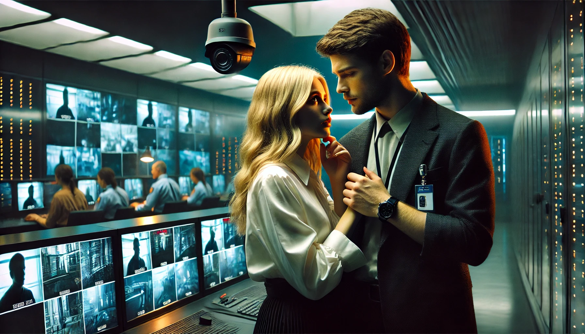

# Conversations

## A Budding Love Story in the Shadow of Surveillance

**Scene:** A quiet corner in the cafeteria. Security officer Jason nervously chats with young assistant Chloe, who’s on her break. Surveillance cameras line the walls.  

**Jason:** [Fidgeting with his coffee cup] “You know, it’s funny. We’re surrounded by cameras every second of the day, but this is the first time I’ve seen you smile.”  
**Chloe:** [Smiling softly] “Maybe I don’t have much to smile about in this place. But you—you’re not like the others.”  
**Jason:** [Laughs nervously] “Well, thanks, I guess. Though, I bet the guys in Security would have a field day if they saw this.”  
**Chloe:** [Looking around] “Do you think they’re watching us right now?”  
**Jason:** [Leaning closer] “Not unless they’re bored. Still, maybe we should keep this…off the grid. You know, meet somewhere quieter?”  
**Chloe:** [Blushing] “You mean…outside the facility?”  
**Jason:** [Grinning] “If we can get past the checkpoints. I’ve got a few tricks up my sleeve.”  
Both laugh softly, the tension melting away—at least for a moment.  

---

## A Love Story under Surveillance

**Scene:** Jason and Chloe meet in a maintenance corridor, away from the cameras. Jason nervously checks his watch as Chloe arrives.  

**Jason:** [Grinning] “You made it. I wasn’t sure you’d come.”  
**Chloe:** [Smiling shyly] “You think I’d pass up my one chance to see the infamous Maintenance Corridor #3?”  
**Jason:** [Chuckling] “Hey, it’s the only place without cameras. For now, at least.”  
**Chloe:** [Teasing] “So, what’s the plan, Mr. Security Expert? Gonna sneak me out of here?”  
**Jason:** [Leaning closer] “Not yet. But I’ve got a friend in Logistics who owes me a favor. If I can get you onto the supply run manifest—”  
**Chloe:** [Interrupting] “Jason, stop. I don’t need you risking your job for me.”  
**Jason:** [Softly] “It’s not just a job, Chloe. This place—it’s wrong. People disappear. Secrets pile up. And you—you’re the only thing that makes any of it bearable.”  
**Chloe:** [Smiling, but with tears in her eyes] “Then let’s find a way out together.”  

---

## A Love Story under Surveillance

**Scene:** Jason, a security officer, nervously glances around the dimly lit maintenance corridor. Chloe, a lab assistant, slips through a side door to meet him.  

**Jason:** [Smiling nervously] “You weren’t followed, right?”  
**Chloe:** [Playfully] “Relax, Jason. No one’s interested in the girl from Research Division B.”  
**Jason:** [Half-smiling] “I am.”  
Chloe blushes but quickly changes the subject.  
**Chloe:** [Leaning against the wall] “So, what’s the grand plan this time? Another coffee date in the cafeteria?”  
**Jason:** [Chuckling] “No. I was thinking we could…you know, get out of here. For good.”  
**Chloe:** [Startled] “Out? You mean leave the facility? Jason, that’s insane.”  
**Jason:** [Lowering his voice] “Is it? Look around, Chloe. This place isn’t normal. The experiments, the disappearances—it’s not safe.”  
**Chloe:** [Looking conflicted] “And where would we go? MJ12 is everywhere.”  
**Jason:** [Determined] “We’d figure it out. Together. I have a contact outside—someone who can help us disappear.”  
**Chloe:** [Softly] “Jason, I—”  
A sudden noise interrupts them. They freeze as a shadow passes near the corridor’s entrance. Jason instinctively steps in front of Chloe.  
**Jason:** [Whispering] “Go. I’ll distract them if I have to.”  
Chloe hesitates but eventually nods, slipping back through the door. Jason watches her go, a mix of hope and dread in his eyes.  

---

## A Forbidden Love under Surveillance

**Scene:** Jason is on his security patrol when he receives a private message on his comm device. It’s Chloe, asking him to meet her in the archives.

Jason enters the dimly lit room, his heart pounding. Chloe is already there, nervously flipping through a file.  
**Jason:** [Whispering] “Chloe, what are you doing here? This place is off-limits.”  
**Chloe:** [Turning to him] “I found something, Jason. Something big.”  
She hands him a file labeled “Project Hermes – Classified.” Jason flips through it, his face growing pale.  
**Jason:** [Horrified] “This is…they’re experimenting on civilians?”  
**Chloe:** [Nodding] “And it gets worse. They’re planning to expand the trials.”  
Jason runs a hand through his hair, his mind racing.  
**Jason:** [Resolute] “We have to do something. Get this out to someone who can stop them.”  
**Chloe:** [Worried] “And then what? Do you think MJ12 will just let us walk away?”  
Before Jason can respond, a voice crackles over the intercom.  
**Intercom Voice:** “Unauthorized access detected in Archives. Security, report immediately.”  
Jason grabs Chloe’s hand.  
**Jason:** “We’ll figure it out later. Right now, we run.”  
The two of them slip out of the room as the sound of approaching footsteps echoes down the hall.  

---

## A Forbidden Love under Surveillance

**Scene:** Jason and Chloe meet in a secluded maintenance corridor. Jason looks around nervously, his hand hovering over his holster.  

**Jason:** [Whispering] “You know we can’t keep doing this. The cameras…”  
**Chloe:** [Smiling faintly] “Relax. This spot’s a blind spot. I checked.”  
Jason sighs and leans against the wall.  
**Jason:** “You’re risking everything, you know that? If they find out…”  
**Chloe:** [Playfully] “If they find out, you’ll have to protect me.”  
He chuckles despite himself, but the moment is short-lived. Chloe’s expression turns serious as she pulls a small device from her pocket.  
**Chloe:** “I found this in the archives. It’s a recording—encrypted, but I managed to unlock part of it.”  
**Jason:** [Frowning] “What’s on it?”  
Chloe hesitates, then plays the recording. A distorted voice speaks.  
**Recording:** “…the asset is unstable. Termination is recommended. Proceed with caution…”  
Jason’s face darkens.  
**Jason:** “They’re talking about the prisoner.”  
**Chloe:** [Nods] “And they’re planning to move him. If we’re going to do something, it has to be now.”  
Jason looks at her, torn between his duty and his growing feelings for her.  
**Jason:** [Quietly] “You’re going to get us both killed, you know that?”  
**Chloe:** [Smiling faintly] “Maybe. But at least we’ll go down together.”  

---

## The Forbidden Love – Sacrifices for Connection

**Scene:** Jason and Chloe are in the archive room, poring over classified files. The faint hum of the facility’s surveillance systems buzzes in the background.  

**Jason:** [Whispering] “If we get caught in here, they’ll bury us.”  
**Chloe:** [Smirking] “You’re already buried in this place, Jason. What’s a little more dirt?”  
Jason shakes his head but can’t suppress a smile. Chloe pulls out a file marked “PROJECT HADES.”  
**Chloe:** “This is it. Proof of what they’re planning.”  
She opens the file, revealing diagrams of human-augmentation experiments. Jason’s face darkens as he flips through the pages.  
**Jason:** [Angrily] “They’re using prisoners as test subjects. This is…this is inhuman.”  
Footsteps echo down the hallway. Jason quickly shuts the file and pulls Chloe into the shadows.  
**Chloe:** [Whispering] “We need to get this to someone who can stop them.”  
**Jason:** [Bitterly] “And who would that be? UNATCO? They’re probably in on it.”  
The footsteps pass, and the two share a tense moment of silence.  
**Chloe:** [Softly] “Then we’ll have to stop them ourselves.”  
Jason looks at her, torn between his loyalty to the facility and his growing feelings for her.  
**Jason:** [Quietly] “You’re going to get me killed, you know that?”  
**Chloe:** [Smiling faintly] “Maybe. But you’d die doing something that matters.”  

---

