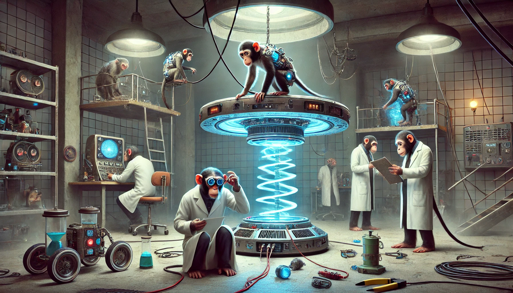

# Conversations

## Monkeys Building a Levitating Device

**Scene:** A research lab. Director Hargrove reviews a report while visibly annoyed. Dr. Lin stands nervously before him.

**Hargrove:** [Reading aloud] “Multiple pieces of laboratory equipment missing: gyroscopes, electromagnetic coils, and…a stabilizer matrix? Lin, explain why I’m reading this.”
**Dr. Lin:** [Stammering] “W-We found the missing items, sir. The primate lab—one of the chimps—uh, several of them, actually…they were building something.”
**Hargrove:** [Raises an eyebrow] “Building what?”
**Dr. Lin:** [Avoiding eye contact] “A…levitating platform. It’s crude, but it works.”
**Hargrove:** [In disbelief] “Are you telling me monkeys are designing anti-grav tech now?”
**Dr. Lin:** “It’s not just that. Their neural implants—they’re…progressing. Beyond what we expected.”
**Hargrove:** [Rubbing his temples] “Terminate the project. And for god’s sake, tighten inventory control.”

---

## Monkeys and the Levitating Device

**Scene:** Director Hargrove storms into the primate lab, followed by Dr. Lin, who’s struggling to keep up.

**Hargrove:** [Furious] “You mean to tell me that a group of monkeys built this?”
**Dr. Lin:** [Gesturing nervously] “It’s…not as simple as that. The neural implants we’ve been testing—they’re enhancing their cognitive abilities faster than anticipated.”
**Hargrove:** [Looking at a crude levitating platform hovering in the corner] “Faster than anticipated? Lin, this is advanced engineering! Who authorized this?”
**Dr. Lin:** [Flustered] “It wasn’t authorized. They scavenged the parts from the scrap pile. At first, we thought it was just…play behavior. But then—”
**Hargrove:** [Cutting him off] “Then you realized you’d created something you can’t control.”
**Dr. Lin:** [Quietly] “They’re…organizing. Sharing tasks. If this continues—”
**Hargrove:** [Sternly] “It won’t. Shut it down, Lin. Permanently.”

---

## Monkeys and the Levitating Device

**Scene:** Director Hargrove is fuming as he storms into the primate lab. Dr. Lin is nervously explaining the situation while lab technicians scramble in the background.  

**Hargrove:** [Gesturing to the hovering platform in the center of the room] “Do you have any idea how bad this looks?”  
**Dr. Lin:** [Defensive] “It’s not my fault! The neural implants accelerated their cognitive development faster than expected.”  
**Hargrove:** [Sarcastic] “And I suppose the monkeys just decided to dabble in engineering on their own?”  
**Dr. Lin:** [Hesitating] “Well…technically, yes.”  
Hargrove stares at him in disbelief. One of the monkeys lets out a series of chirps, seemingly directing another to adjust a component on the platform.  
**Hargrove:** [Deadpan] “They’re organizing. Do you realize what this means?”  
**Dr. Lin:** [Quietly] “It means they’re smarter than we thought.”  
**Hargrove:** [Coldly] “It means they’re a liability. Shut it down, Lin. I don’t care how.”  
A technician nearby mutters under their breath.  
**Technician:** “At this rate, they’ll take over the whole lab.”  
Hargrove shoots the technician a glare.  
**Hargrove:** [Firmly] “Not if I have anything to say about it.”  

--

## The Monkey Conspiracy Deepens

**Scene:** Dr. Lin is in his office, staring at a report. The monkeys have made further progress, and the latest device now levitates steadily in the primate lab.  

**Dr. Lin:** [To himself] “This…this can’t be real.”  
A knock at the door startles him. It’s Director Hargrove, looking grim.  
**Hargrove:** [Holding up a tablet] “You’ve seen the footage, I assume.”  
**Dr. Lin:** [Nervously] “Yes, but—”  
**Hargrove:** [Cutting him off] “Save it. They’ve gone beyond engineering. The latest scans show increased brain activity—higher than any human on record.”  
**Dr. Lin:** [Incredulous] “Are you saying they’re…smarter than us?”  
**Hargrove:** [Coldly] “I’m saying they’re a threat. And threats get eliminated.”  
Dr. Lin hesitates, then speaks carefully.  
**Dr. Lin:** “What if we could control them? Harness their intelligence instead of destroying it?”  
**Hargrove:** [Smirking] “You really think you can outsmart them, Lin? Because I don’t.”  
In the background, a faint hum grows louder. The levitating device floats past the office window, carrying a group of monkeys, who stare at the two men with eerie intelligence.  

---

## The Monkey Conspiracy Deepens

**Scene:** Dr. Lin is in the primate lab, monitoring the levitating device. The monkeys are clustered together, seemingly communicating in their own language.  

**Dr. Lin:** [Into his recorder] “Day 47. Subjects have demonstrated advanced engineering capabilities. Neural scans suggest a hive-mind structure.”  
A loud crash interrupts him. He turns to see a monkey holding a broken camera, its eyes gleaming with intelligence.  
**Dr. Lin:** [Nervously] “What are you doing?”  
The monkey doesn’t respond. Instead, it gestures to the levitating device, which begins to hum. Dr. Lin watches in disbelief as the device rises higher, emitting a faint blue light.  
**Dr. Lin:** [Whispering] “This…this is beyond us.”  
Suddenly, Director Hargrove enters, flanked by armed guards.  
**Hargrove:** [Coldly] “Time’s up, Lin. We’re shutting this down.”  
**Dr. Lin:** [Desperately] “You don’t understand. They’re—”  
**Hargrove:** [Cutting him off] “They’re a liability. Terminate them.”  
Before Dr. Lin can protest, the monkeys begin to scatter. The levitating device pulses brighter, and for a brief moment, the room is bathed in light. When it fades, the monkeys—and the device—are gone.  

---

## The Monkey Conspiracy – The Return

**Scene:** Weeks after the monkeys disappeared, strange energy readings are detected near the facility. Dr. Lin is called into Director Hargrove’s office.  

**Hargrove:** [Slamming a report onto the desk] “Explain this.”  
**Dr. Lin:** [Reading the report] “Residual energy signatures…gravitational anomalies. This can’t be right.”  
**Hargrove: **[Coldly] “It’s very right, Doctor. And it’s coming from your monkeys.”  
**Dr. Lin:** [Defensively] “They weren’t just monkeys. They were—”  
**Hargrove:** [Cutting him off] “I don’t care what they were. I care that they’ve resurfaced with tech we can’t even comprehend.”  
Lin hesitates, then speaks carefully.  
**Dr. Lin:** “If they’ve evolved beyond us…we may not be able to stop them.”  
**Hargrove:** [Leaning in] “Then you’d better hope they don’t come back for revenge.”  

---

