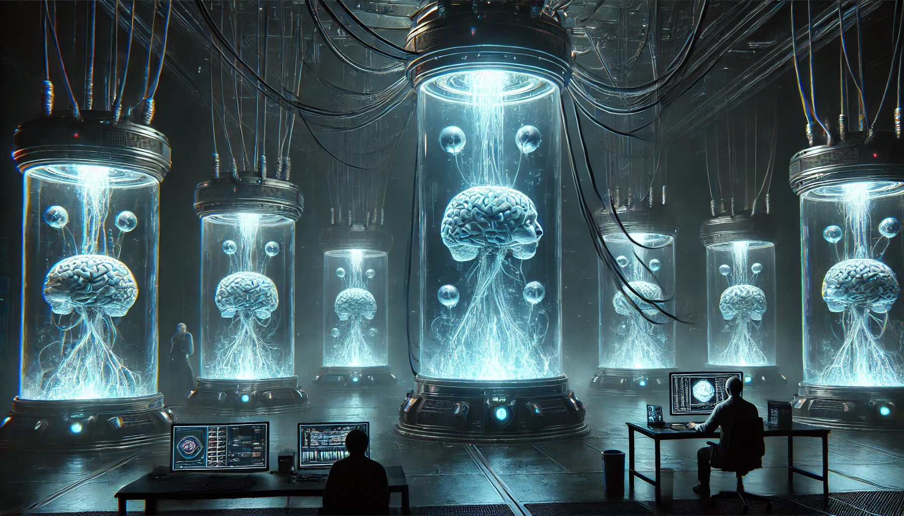

# Conversations

## Human Brains in Tubes and a Foreshadowing Prophecy

**Scene:** A dark, eerie lab filled with glowing tanks. Dr. Greaves reviews a report on the latest tests with Dr. Fenton, standing beside a liquid-filled tube containing a human brain. The faint hum of machinery fills the air.

**Dr. Greaves:** [Reading] “Subject Gamma-17: increased neural activity during remote viewing trials. The subject accurately described the New York skyline—something they’ve never seen before.”

**Dr. Fenton:** “Impressive, but we need more than party tricks. What about predictive capabilities?”

**Dr. Greaves:** [Pausing] “That’s where it gets…unsettling. During the last trial, Gamma-17 started convulsing. They described an event—a fire in this facility. Security breaches, alarms, and…”

**Dr. Fenton:** [Leaning in] “And what?”

**Dr. Greaves:** [Softly] “Someone escaping. A man with augmented capabilities.”

**Dr. Fenton:** [Whispering] “Denton?”

**Dr. Greaves:** [Nods grimly] “Or someone like him. The details are fragmented, but the vision was clear enough to prompt an escalation protocol.”

**Dr. Fenton:** “If the brain knows our future, do we even have one?”

**Dr. Greaves:** [Sternly] “That’s not our concern. What matters is ensuring the prophecy doesn’t come to pass. Double security, restrict lab access, and for god’s sake, keep this contained.”

---

## Prophecy from the Brain in the Tube

**Scene:** Dr. Greaves and Dr. Fenton stand in a dimly lit room, staring at a tank containing a human brain suspended in liquid. The air hums with electricity.

**Dr. Fenton:** [Nervously] “Gamma-17’s activity spiked again. Another vision.”

**Dr. Greaves:** [Calmly flipping through notes] “Go on.”

**Dr. Fenton:** [Hesitant] “They described a man breaking into the mainframe. A breach in the containment chamber. And…something else.”

**Dr. Greaves:** [Looking up] “What else?”

**Dr. Fenton:** [Whispering] “Fire. Explosions. The facility…burning. And in the chaos, the subject said they ‘felt freedom.’”

**Dr. Greaves:** [Sternly] “Freedom? That’s not possible.”

**Dr. Fenton:** [Uneasily] “They said the man—the one who escapes—will be the key to everything. ‘The Helios Protocol,’ they called it.”

**Dr. Greaves:** [Pausing] “Activate Level Three security protocols. If there’s any truth to this, we can’t afford to take chances.”

---

## Prophecy from the Brain in the Tube

**Scene:** Dr. Greaves and Dr. Fenton stand before a cylindrical tank. Inside, a brain suspended in glowing liquid pulses faintly as it “speaks” through an audio interface.  

- **Brain:** [Distorted] “Freedom…chaos…fire…”  

- **Dr. Fenton:** [Typing frantically] “The patterns are consistent with its previous visions. But this one’s different—it’s more…specific.”  

- **Dr. Greaves:** [Leaning closer] “What’s it saying?”  

- **Brain:** [Echoing] “A man…a captive…breaks the chains. He burns the cage.”  

- **Dr. Fenton:** [Nervously] “It’s the escape sequence again. But now it’s naming the Helios Protocol.”  

- **Dr. Greaves:** [Quietly] “Helios…that’s classified beyond our level. How could it know?”  

- **Brain:** [With finality] “The man will end us all. Or save us.”  

A chilling silence falls over the room. Dr. Greaves finally straightens, his face pale.  

- **Dr. Greaves:** [To Fenton] “Triple security. And notify the Director. We can’t afford to ignore this anymore.”  

---

## Prophecy from the Brain in the Tube – A Dark Warning

**Scene:** Dr. Greaves is reviewing the latest data when the brain in the tank begins speaking again. This time, its voice is clearer, more deliberate.  

- **Brain:** [Calmly] “The man you hold will bring fire to the sky. He is the key.”  

- **Dr. Fenton:** [Alarmed] “What does that mean? What key?”  

- **Brain:** [Softer now] “The key to freedom…or destruction.”  

- **Dr. Greaves:** [Trying to stay calm] “What do you see? Tell us.”  

The brain pauses, its glowing neural pathways flickering erratically.  

- **Brain:** “I see the fall of this place. The walls crumble, the gates open. And beyond…chaos.”  

- **Dr. Fenton:** [Whispering] “It’s the escape. It knows.”  

- **Dr. Greaves:** [Firmly] “Then we contain the man. Double the guards, lock down the facility. Nothing gets in or out.”  

The brain’s voice grows louder, almost mocking.  

- **Brain:** “You cannot stop it. The wheel turns, and the end begins.”  

A sudden power surge causes the lights to flicker. When they stabilize, the brain is silent. Dr. Greaves stares at it, his face pale.  

- **Dr. Greaves:** [To Fenton] “We’re running out of time.”  

---

## The Brain’s Prophecy – A Final Warning

**Scene:** Dr. Greaves and Dr. Fenton are in the observation chamber, staring at the silent brain in the tank. Suddenly, the lights flicker, and the brain’s voice returns, louder than before.  

- **Brain:** “He is the spark. The fire that will consume this place.”  

- **Dr. Fenton:** [Alarmed] “You mean the prisoner?”  

- **Brain:** “The prisoner is more than you know. He is the key to a war that has not yet begun.”  

- **Dr. Greaves:** [Demanding] “What war? What are you talking about?”  

- **Brain:** [Quietly] “Look to the stars. You will see.”  

The lights flicker again, and the brain’s neural pathways pulse erratically. On the monitor, a series of star charts appear, pointing to a distant system.  

- **Dr. Fenton:** [Confused] “Sigma Boötis? What’s there?”  

- **Brain:** [With finality] “Salvation. Or annihilation.”  

The room falls silent as the brain shuts down, its lights fading. Dr. Greaves and Dr. Fenton exchange uneasy glances.  

- **Dr. Greaves:** [Quietly] “We need to inform the board. Now.”  

---

## The Brain’s Prophecy – The Final Vision

**Scene:** Dr. Greaves is alone in the observation chamber. The brain has been reactivated, but its neural patterns are erratic.  

- **Brain:** [Distorted] “The spark is lit. The fire grows.”  

- **Dr. Greaves:** [Desperately] “What do you mean? What fire?”  

- **Brain:** [Softly] “The fire of freedom. The prisoner will break the chains.”  

Greaves watches as the brain’s projections show images of chaos: labs in flames, guards fighting shadows, and a lone figure escaping into the night.  

- **Brain:** “They cannot contain what they do not understand.”  

- **Dr. Greaves:** [Whispering] “Is it inevitable?”  

- **Brain:** [Calmly] “Yes. But you still have a choice. Stand with him…or fall with them.”  

The projections vanish, leaving Greaves alone with his thoughts. Outside the chamber, faint alarms begin to sound, signaling the beginning of the end.  

---
